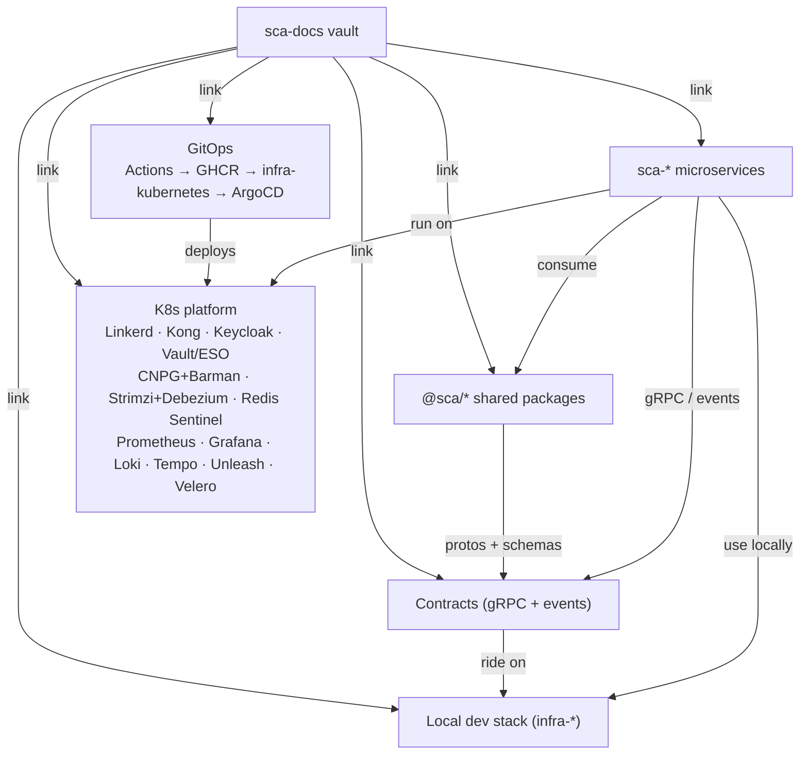

# Ecosystem overview

> The global view: the ecosystem's layers, repositories and how they depend on each other.

## Layers

- **Microservices layer** — the domains, each a [[microservice]] cloned from `nest-template`.
- **Shared packages layer** — `@sca/*` plumbing with zero business logic; the single place a shared fix lands.
- **Contracts layer** — the agreements between services: [[grpc]] APIs and Kafka [[event]]s, defined once in `@sca/contracts`.
- **Infrastructure layer** — two tiers: the [[self-hosted-stack|local dev stack]] (Vault, PostgreSQL, Redis, [[kafka]], Consul, Prometheus, Grafana — one `infra-*` repo each) and the portable Kubernetes platform ([[platform-overview]]) every service deploys to.
- **Delivery layer** — GitOps: merges to `main` build images (GitHub Actions → GHCR), bump tags in `infra-kubernetes` via PR, and ArgoCD syncs each environment ([[adr-003-gitops-argocd-trunk-based]]).
- **Documentation layer** — this vault: topology, conventions and pointers.

## Repositories

| Repo | Role | Status |
|---|---|---|
| `nest-template` | [[modular-monolith]] skeleton + handbook; source of every service | active |
| `@sca/*` | Shared plumbing (core, contracts, connections, clients) | planned |
| `sca-*` | Domain microservices (auth, notifications, logging, ai) | planned |
| `infra-vault` | Secrets management | active |
| `infra-postgres-app` | PostgreSQL + pgAdmin | active |
| `infra-redis` | Redis in-memory store | active |
| `infra-kafka` | Kafka + Debezium + Kafka UI | active |
| `infra-consul` | Service discovery + health checks | active |
| `infra-prometheus` | Metrics + exporters | active |
| `infra-grafana` | Dashboards + alerting | active |
| `infra-kubernetes` | Kubernetes manifests + charts — GitOps source of truth | planned |
| `sca-docs` | This vault | active |

> All `infra-*` repos are local-development tooling; cluster deployments come exclusively from `infra-kubernetes` via ArgoCD.

## Dependencies

- Each `sca-*` **consumes** `@sca/*` and the `nest-template` structure; it exposes its own [[grpc]] API and publishes/consumes [[event]]s.
- `@sca/contracts` is the **source of truth** for [[proto]] files and event schemas; contract notes in `02-contracts/` link to it.
- Events travel over [[kafka]] with the [[outbox|outbox pattern]] guaranteeing delivery.
- Services connect to infrastructure with [[service-account|service accounts]]; credentials live in Vault and reach workloads through External Secrets Operator on the platform.
- Deployments flow GitOps-only: Actions → GHCR → `infra-kubernetes` → ArgoCD ([[gitops]], [[adr-003-gitops-argocd-trunk-based]]).

## Where the depth lives

Depth lives in each repo, never in the vault: `nest-template`'s handbook (`00-project`, `01-principles`, `02-architecture`, `04.1-flow-definitions`) is the reference for structure and flows; the vault only links to it. The [[conventions]] note is the norm that keeps this true.

## Related

- [[super-template]] · [[clone-and-start]] · [[conventions]]
- [[99-glossary/INDEX|Glossary]]
