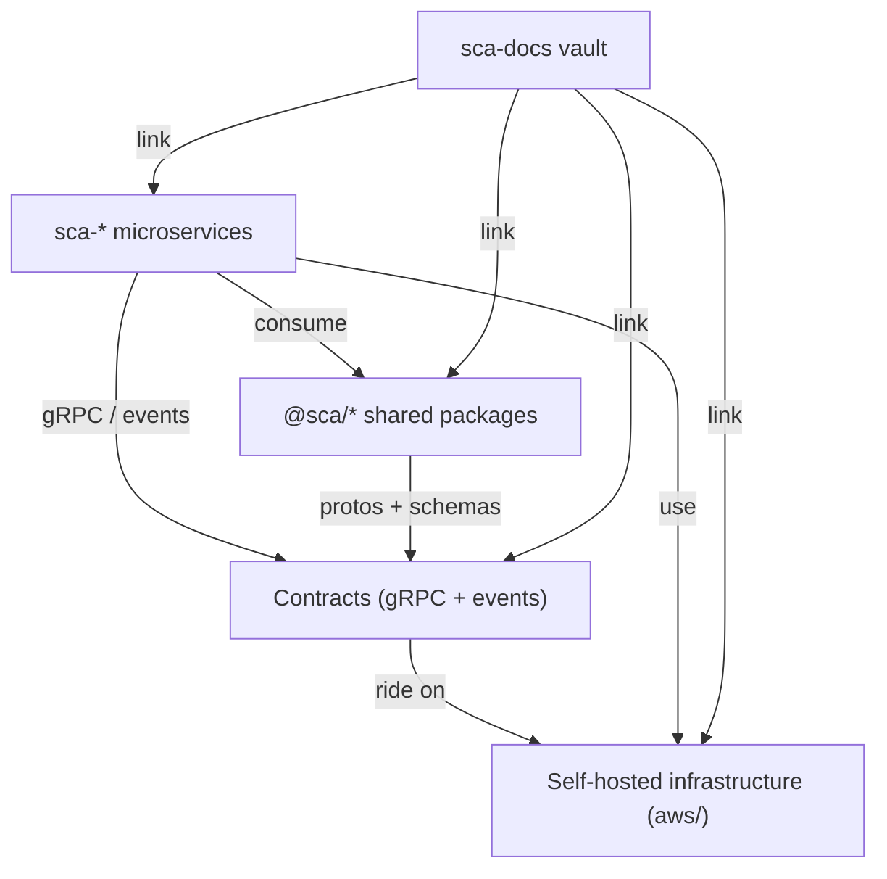

# Ecosystem overview

> The global view: the ecosystem's layers, repositories and how they depend on each other.

## Layers

- **Microservices layer** — the domains, each a [[microservice]] cloned from `nest-template`.
- **Shared packages layer** — `@sca/*` plumbing with zero business logic; the single place a shared fix lands.
- **Contracts layer** — the agreements between services: [[grpc]] APIs and Kafka [[event]]s, defined once in `@sca/contracts`.
- **Infrastructure layer** — [[self-hosted]] components (Vault, PostgreSQL, Redis, [[kafka]], Consul) orchestrated by `aws/`.
- **Documentation layer** — this vault: topology, conventions and pointers.

## Repositories

| Repo | Role | Status |
|---|---|---|
| `nest-template` | [[modular-monolith]] skeleton + handbook; source of every service | active |
| `@sca/*` | Shared plumbing (core, contracts, connections, clients) | planned |
| `sca-*` | Domain microservices (auth, notifications, logging, ai) | planned |
| `aws` | [[self-hosted]] stack orchestrator (`make all`) | active |
| `sca-docs` | This vault | active |

## Dependencies

- Each `sca-*` **consumes** `@sca/*` and the `nest-template` structure; it exposes its own [[grpc]] API and publishes/consumes [[event]]s.
- `@sca/contracts` is the **source of truth** for [[proto]] files and event schemas; contract notes in `02-contracts/` link to it.
- Events travel over [[kafka]] with the [[outbox|outbox pattern]] guaranteeing delivery.
- Services connect to infrastructure with [[service-account|service accounts]]; credentials live in Vault.

## Where the depth lives

Depth lives in each repo, never in the vault: `nest-template`'s handbook (`00-project`, `01-principles`, `02-architecture`, `04.1-flow-definitions`) is the reference for structure and flows; the vault only links to it. The [[conventions]] note is the norm that keeps this true.

## Related

- [[super-template]] · [[clone-and-start]] · [[conventions]]
- [[99-glossary/INDEX|Glossary]]
