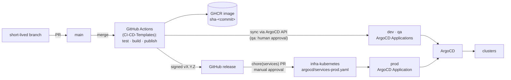

# Platform overview

> The target platform for every [[microservice]] in the `sca` ecosystem: a portable Kubernetes substrate built on open-source operators — the same stack on any public cloud or on-premises.

## What the platform is

Every service ships as a container and runs on **Kubernetes** across three environments (`dev`, `qa`, `prod`). All critical platform components are open-source operators running inside the cluster, so moving between AWS, Azure, GCP or self-hosted infrastructure never touches application code. Managed cloud services are optional per project ([[multi-cloud]]).

## Principles

- **Multi-cloud portability** — everything critical runs on Kubernetes with open-source operators; provider migrations require no app changes.
- **Reliability** — high availability, self-healing, replication and automated backups everywhere.
- **Integral security** — centralized secrets, per-pod service identity, encryption in transit, end-user authentication at the edge.
- **Full observability** — metrics, logs and traces converge in a single visualization platform.
- **Operational efficiency** — GitOps and Trunk-Based Development make every deployment declarative, reviewed and reproducible.
- **Cost optimization** — self-host on Kubernetes first; adopt a managed service only when operating the component costs more than renting it.
- **Environment management** — dev/qa/prod are mirrors differing only in replicas, resources, secrets and feature flags, all declared in Git.

## Stack

| Layer              | Tool                                            | Role                                                                 |
| ------------------ | ----------------------------------------------- | -------------------------------------------------------------------- |
| Orchestration      | Kubernetes                                      | Single runtime for services and platform components                  |
| Service discovery  | Kubernetes DNS                                  | Native in-cluster resolution                                         |
| Service mesh       | Linkerd                                         | mTLS identity, retries/timeouts, network telemetry                   |
| API gateway        | Kong Ingress Controller                         | Routing, rate limiting, edge authentication                          |
| Secrets            | [[vault]] (HA Raft) + External Secrets Operator | Source of truth; projected into native K8s Secrets                   |
| Packaging          | Helm                                            | Parameterized charts per service and environment                     |
| GitOps / deploy    | ArgoCD                                          | Applies the declared state of `infra-kubernetes` to each cluster     |
| CI/CD              | GitHub Actions + GHCR                           | Shared workflows from `CI-CD-Templates`; tests, build, publish on merge to `main` |
| Branching          | Trunk-Based Development                         | Short-lived branches integrated frequently                           |
| Messaging / events | [[kafka]] (Strimzi)                             | HA streaming backbone with replicated partitions                     |
| CDC / outbox       | Debezium (Kafka Connect)                        | Captures PostgreSQL changes into topics — the [[outbox]] pattern     |
| Relational data    | [[postgres]] (CloudNativePG)                    | 1 primary + 2 read replicas, logical replication, automatic failover |
| PostgreSQL backup  | Barman (with CloudNativePG)                     | Physical backups + WAL archiving → point-in-time recovery            |
| Cache / pub-sub    | [[redis]] (operator + Sentinel)                 | High-performance cache with master failover                          |
| Metrics            | [[prometheus]] + [[grafana]]                    | Infrastructure, application and mesh-network metrics                 |
| Logs               | Loki (+ Promtail / OpenTelemetry Collector)     | Centralized logs, visualized next to metrics                         |
| Tracing            | Tempo (+ OpenTelemetry SDKs)                    | Distributed traces correlated across services                        |
| Feature flags      | Unleash                                         | Per-environment toggles without redeploying code                     |
| Authentication     | Keycloak                                        | Self-hosted OIDC/JWT identity provider                               |
| Cluster backup     | Velero                                          | Kubernetes resources + persistent volumes to object storage          |

## Delivery flow



1. Developers work on short-lived branches; the only branch that receives PRs is `main`.
2. A merge to `main` triggers GitHub Actions (shared workflows from `CI-CD-Templates`): tests run, the Docker image builds and publishes to GHCR as `sha-<commit>`.
3. Dev and qa are **Application syncs, not PRs**: `shared-service-promote.yml` calls the ArgoCD API to sync the service's `dev`/`qa` Application to the merged commit. A real qa promote runs against the `qa` GitHub Environment and waits for human approval (Required reviewers).
4. Prod promotes by pin: `shared-release-flow.yml` produces an immutable signed `vX.Y.Z` tag; `shared-adopt-prod.yml` opens a `chore(services)` PR pinning that tag in `argocd/services-prod.yaml` of `infra-kubernetes`, gated by manual approval; ArgoCD syncs `prod` in the manual sync window. `shared-enforce-latest.yml` then corrects GitHub `latest` to the running version.
5. Unleash feature flags enable or disable functionality per environment without additional deploys.

## Repository model

- Each microservice lives in its own repository under the GitHub organization, owning its code, business logic, application configuration, Dockerfile and image pipeline ([[adr-005-per-service-repos-centralized-k8s-config]]).
- Service repositories contain no Kubernetes manifests — deploying or promoting a service is always a change in `infra-kubernetes`.
- `infra-kubernetes` is the single declarative home of everything the clusters run:

```text
infra-kubernetes/
├── charts/              # microservice + infrastructure Helm charts
├── envs/
│   ├── dev/             # values.yaml + secrets.yaml (Vault references)
│   ├── qa/
│   └── prod/
├── argocd/              # applications-dev.yaml · applications-qa.yaml · applications-prod.yaml · services-prod.yaml (prod pins)
└── feature-flags/       # dev.yaml · qa.yaml · prod.yaml
```

Each ArgoCD Application watches one environment path (`envs/dev`, `envs/qa`, `envs/prod`); Helm values are parameterized per environment; `argocd/services-prod.yaml` is the prod version registry (one `element` per service in an ApplicationSet `list` generator).

## Environments

| Environment | Purpose                                                | Profile                                                            |
| ----------- | ------------------------------------------------------ | ------------------------------------------------------------------ |
| `dev`       | Continuous integration, unit tests, active development | Reduced configuration, minimum scaling, experimental flags on      |
| `qa`        | Integration, performance and acceptance testing        | Production-shaped configuration, fictitious/anonymized data        |
| `prod`      | Stable operation                                       | High availability, autoscaling, strict security and audit policies |

`dev` and `qa` follow every merge to `main`: `shared-service-promote.yml` syncs the service's ArgoCD Application to the merged commit via the ArgoCD API — no PR; a qa promote waits for human approval on the `qa` GitHub Environment. Only `prod` promotes by pinning an immutable signed `vX.Y.Z` tag in `argocd/services-prod.yaml` of `infra-kubernetes`, through a `chore(services)` pull request with manual approval gating it. Feature flags stage functionality gradually per environment.

## Security model

- **Service identity** — Linkerd issues mTLS identities per pod: encrypted, authorized service-to-service traffic plus retries/timeouts policies and per-pair traffic metrics.
- **Secrets** — [[vault]] remains the source of truth (dynamic credentials, automatic rotation); External Secrets Operator projects secrets into native Kubernetes Secrets.
- **User authentication** — Keycloak issues OIDC/JWT tokens; Kong validates them at the edge before traffic reaches any API. Authorization is application-owned: [[go-authz]] checks effective scopes per request ([[adr-006-keycloak-authentication-only-and-go-authz]]), and sessions/devices failing trust conditions are blocked entirely at the edge rather than degraded.
- **In-cluster access** — Kubernetes RBAC controls access to resources inside the cluster.

## Observability

Four pillars, one pane of glass in Grafana — coverage map in [[observability]]:

- **Infrastructure and application metrics** — Prometheus scrapes nodes, pods and apps.
- **Network metrics** — Linkerd exports latency, throughput and error rate per pair of services.
- **Logs** — Loki stores container/application logs shipped by Promtail or the OpenTelemetry Collector.
- **Traces** — Tempo receives OpenTelemetry distributed traces, correlating requests end-to-end.

## Data and events

- **PostgreSQL** runs as a CloudNativePG cluster — one primary, two read replicas — with operator-managed failover and the logical replication CDC needs; Barman archives physical backups and WALs for point-in-time recovery.
- **Kafka** runs highly available via Strimzi (replicated partitions, persistent storage); Debezium captures `outbox` table changes into Kafka topics, keeping database and published [[event]]s consistent.
- **Redis** runs behind Sentinel with automatic master failover.
- **Backups** — Barman (PostgreSQL) and Velero (cluster resources + volumes) both target S3-compatible object storage; restores are drilled on an alternate cluster.

## Portability policy

Cloud-native managed services (RDS, MSK, ElastiCache, Cognito…) are **optional per project** — either as primary or as disaster-recovery failover — judged on total cost, availability requirements, lock-in tolerance and operational complexity. See [[multi-cloud]].

## Cost levers

- Self-hosting on Kubernetes reduces direct cost versus managed equivalents.
- Autoscaling of nodes and replicas; spot instances for stateless workloads.
- Scheduled shutdown of non-productive environments outside traffic hours.
- Ongoing cost review: when operating a component costs more than renting it, migrate it to a managed service or keep the managed option as failover.

## Related

- Local counterpart: [[self-hosted-stack]] — the Compose stack, development only
- Failover strategy: [[multi-cloud]] · Monitoring map: [[observability]]
- Decisions: umbrella [[adr-001-kubernetes-platform]]; focused [[adr-002-linkerd-service-mesh]] · [[adr-003-gitops-argocd-trunk-based]] · [[adr-004-keycloak-identity]] · [[adr-005-per-service-repos-centralized-k8s-config]] · [[adr-006-keycloak-authentication-only-and-go-authz]] · [[adr-008-shared-cicd-templates-promote-pin-model]]
