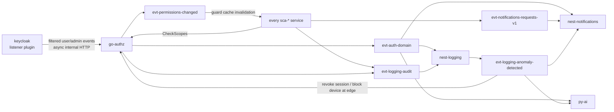
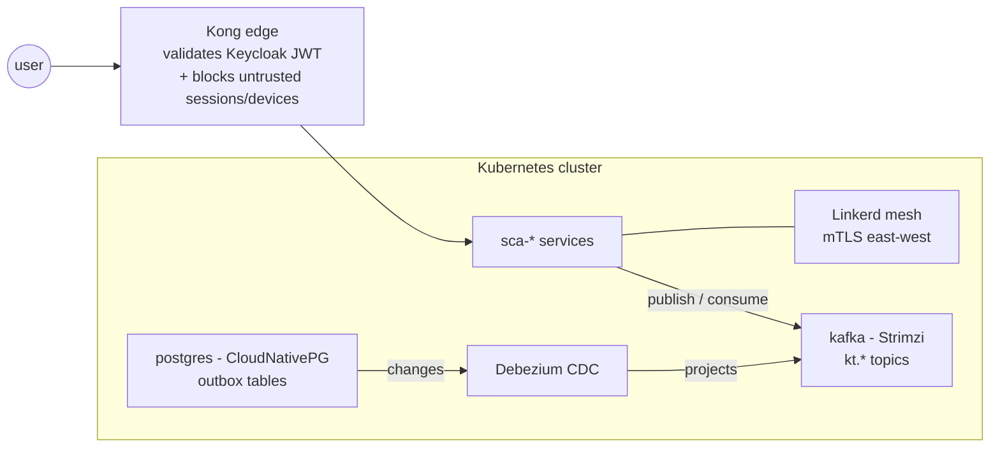

# Connection Map

> Derived from `01-services/` and `02-contracts/`. Regenerate with the `sync-catalogs` skill whenever a service or contract note changes. Deprecated tombstones ([[nest-auth]], [[grpc-auth-api]]) are excluded from the graph.

## gRPC

| API                | Server       | Clients                                                                            |
| ------------------ | ------------ | ---------------------------------------------------------------------------------- |
| [[grpc-authz-api]] | [[go-authz]] | [[nest-notifications]] · [[nest-logging]] · [[py-ai]] (guards via [[sca-clients]]) |

## Kafka

| Event                             | Producers                    | Consumers                                             |
| --------------------------------- | ---------------------------- | ----------------------------------------------------- |
| [[evt-auth-domain]]               | [[go-authz]]                 | [[nest-logging]] · [[nest-notifications]] · [[py-ai]] |
| [[evt-permissions-changed]]       | [[go-authz]]                 | every service (guard cache invalidation)              |
| [[evt-notifications-requests-v1]] | any service                  | [[nest-notifications]]                                |
| [[evt-logging-audit]]             | every service · [[go-authz]] | [[nest-logging]]                                      |
| [[evt-logging-anomaly-detected]]  | [[nest-logging]]             | [[py-ai]] · [[nest-notifications]] · [[go-authz]]     |

## Platform substrate

Derived from [[platform-overview]] and the component notes — how every edge above travels once services run on Kubernetes:

| Concern                           | Provided by                                                                                                                        |
| --------------------------------- | ---------------------------------------------------------------------------------------------------------------------------------- |
| North-south entry & rate limiting | [[kong]]                                                                                                                           |
| End-user identity (OIDC/JWT)      | [[keycloak]], validated at the edge by [[kong]]                                                                                    |
| Fine-grained authorization        | [[go-authz]] — effective scopes checked per request, never from JWT claims ([[adr-006-keycloak-authentication-only-and-go-authz]]) |
| East-west trust (mTLS)            | [[linkerd]] ([[service-mesh]])                                                                                                     |
| Events backbone                   | [[kafka]] on Strimzi                                                                                                               |
| Outbox CDC                        | Debezium reading [[postgres]] ([[outbox]], [[cdc]])                                                                                |
| Secrets                           | [[vault]] projected via [[external-secrets-operator]]                                                                              |
| Metrics · logs · traces           | [[prometheus]] · [[grafana]] · [[loki]] · [[tempo]]                                                                                |
| Deploy & promotion                | [[argocd]] ← `infra-kubernetes` ([[gitops]])                                                                                       |
| Feature release                   | [[unleash]]                                                                                                                        |

## Edge cases

- `evt-permissions-changed` and `evt-logging-audit` have "every service" in a role — the graph edges grow as services are added.
- `evt-notifications-requests-v1` producers are not fixed; the map lists the known ones in the contract note.
- Keycloak's listener plugin reaches [[go-authz]] over an internal HTTP route, not through Kafka or a vault contract note.
