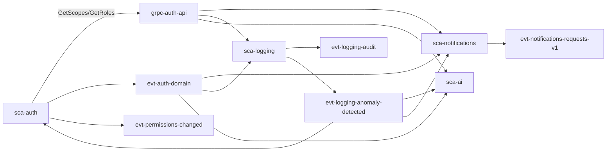

# Connection Map

> Derived from `01-services/` and `02-contracts/`. Regenerate with the `sync-catalogs` skill whenever a service or contract note changes.

## gRPC

| API | Server | Clients |
|---|---|---|
| [[grpc-auth-api]] | [[sca-auth]] | [[sca-notifications]] · [[sca-logging]] · [[sca-ai]] |

## Kafka

| Event | Producers | Consumers |
|---|---|---|
| [[evt-auth-domain]] | [[sca-auth]] | [[sca-logging]] · [[sca-notifications]] · [[sca-ai]] |
| [[evt-permissions-changed]] | [[sca-auth]] | every service (cache invalidation) |
| [[evt-notifications-requests-v1]] | any service | [[sca-notifications]] |
| [[evt-logging-audit]] | every service | [[sca-logging]] |
| [[evt-logging-anomaly-detected]] | [[sca-logging]] | [[sca-ai]] · [[sca-notifications]] · [[sca-auth]] |

## Edge cases

- `evt-permissions-changed` and `evt-logging-audit` have "every service" in a role — the graph edges grow as services are added.
- `evt-notifications-requests-v1` producers are not fixed; the map lists the known ones in the contract note.
