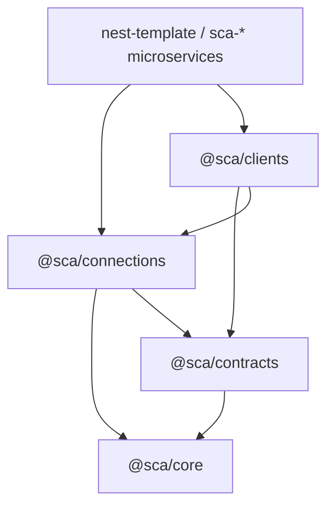

# Packages — INDEX

> The `@sca/*` shared packages: plumbing, config and transport with **zero business logic** — one fix lands here, not in every [[microservice]].

## Notes

| Note | What it is | Status |
|---|---|---|
| [[sca-core]] | Pure code: helpers, utils, errors, types, constants | planned |
| [[sca-contracts]] | `.proto` source of truth + multi-language codegen | planned |
| [[sca-connections]] | Connections with multi-cloud failover + gRPC factory | planned |
| [[sca-clients]] | Typed clients per microservice + shared auth guards | planned |

## Dependency direction

## Keywords

packages, shared plumbing, sca-core, contracts, proto, grpc, connections, failover, multi-cloud, clients, guards, zero business logic

## Search order

1. Read [[sca-core]] first — the pure foundation the other three build on.
2. Then [[sca-contracts]] (the sync mechanism) and [[sca-connections]] (the heavy one).
3. [[sca-clients]] last — it consumes both and is where shared auth lives.
