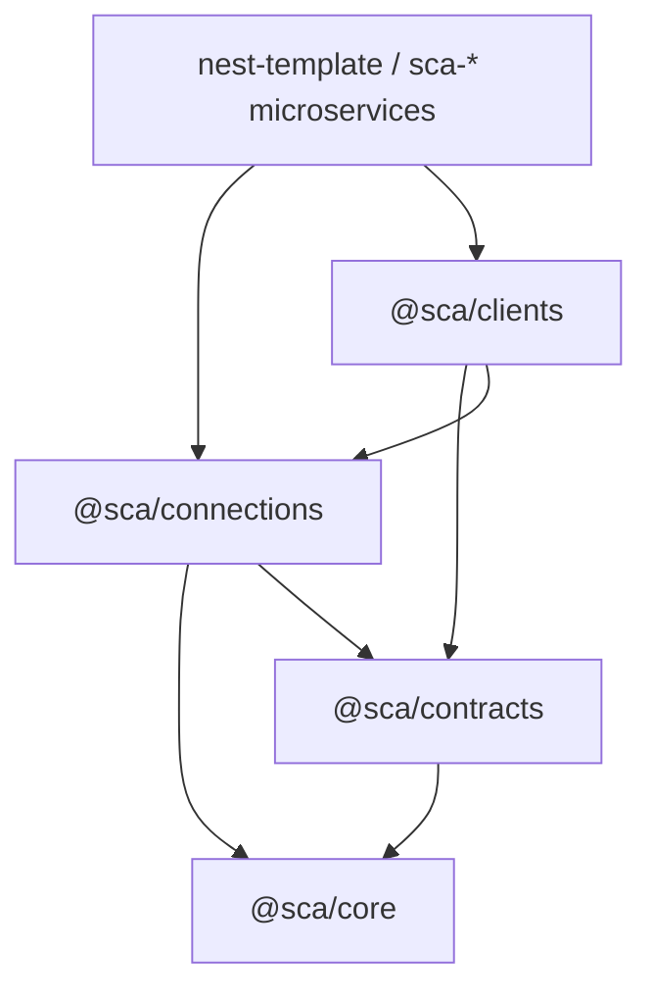

# Packages — INDEX

> The shared packages — `@sca/*` (the in-workspace suite) and `@sca-templates/*`
> (published standalone): plumbing, config and transport with **zero business
> logic** — one fix lands here, not in every [[microservice]].

## Notes

| Note | What it is | Status |
|---|---|---|
| [[sca-core]] | Pure code: helpers, utils, errors, types, constants | planned |
| [[sca-contracts]] | `.proto` source of truth + multi-language codegen | planned |
| [[sca-connections]] | Connections with multi-cloud failover + gRPC factory | planned |
| [[sca-clients]] | Typed clients per microservice + shared auth guards | planned |
| [[node-server-core]] | Node.js shared plumbing: helpers, errors, constants | planned |

## Dependency direction

```mermaid
flowchart TD
    CORE["@sca/core"]
    CTR["@sca/contracts"]
    CONN["@sca/connections"]
    CL["@sca/clients"]
    SVC["nest-template / sca-* microservices"]

    CTR --> CORE
    CONN --> CORE
    CONN --> CTR
    CL --> CTR
    CL --> CONN
    SVC --> CONN
    SVC --> CL
```

## Keywords

packages, shared plumbing, sca-core, contracts, proto, grpc, connections, failover, multi-cloud, clients, guards, node-server-core, node, typescript, zero business logic

## Search order

1. Read [[sca-core]] first — the pure foundation the other three build on.
2. Then [[sca-contracts]] (the sync mechanism) and [[sca-connections]] (the heavy one).
3. [[sca-clients]] last — it consumes both and is where shared auth lives.
4. [[node-server-core]] is the standalone Node.js counterpart: same idea as
   [[sca-core]], but published on its own under `@sca-templates/`.
